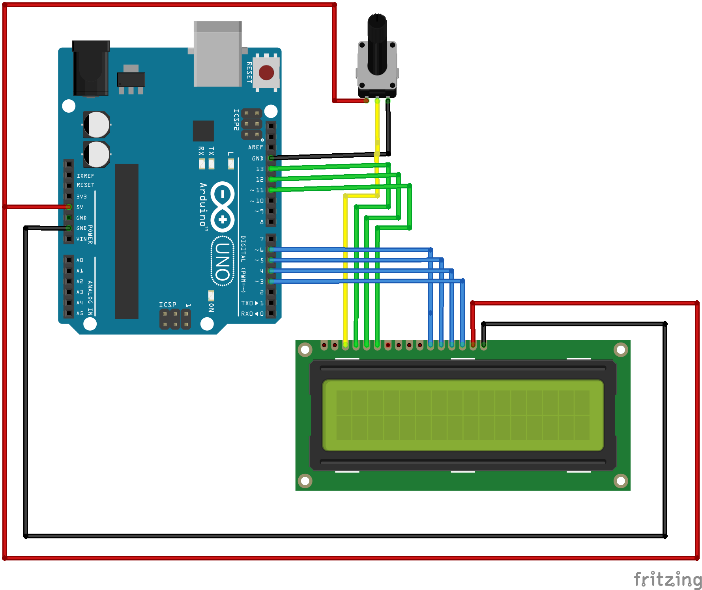

 # Trabajo Final de Arquitetura de Hardware : 
Trabajo Final de Arquitetura de Hardware | Universidad EIA

## Requerimientos
* processing | [https://nodejs.org/es/](https://nodejs.org/es/)
* arduino  |  [https://www.npmjs.com](https://www.npmjs.com)

## API
* iohook | [https://wilixlead.github.io/iohook](https://wilixlead.github.io/iohook)
* serialport | [https://serialport.io/docs/api-stream](https://serialport.io/docs/api-stream)

## Conexion de Hardware 

## Recursos

* https://github.com/node-serialport/node-serialport/issues/267

* https://arduino.stackexchange.com/questions/18949/serial-communication-to-arduino-with-node-js

### Miembros
*  Jeisson Barrera| jbarrera094@gmail.com
*  Kevin Alexander Ibarra | 
*  Mateo Zuluaga Loaiza |zulo30@gmail.com

